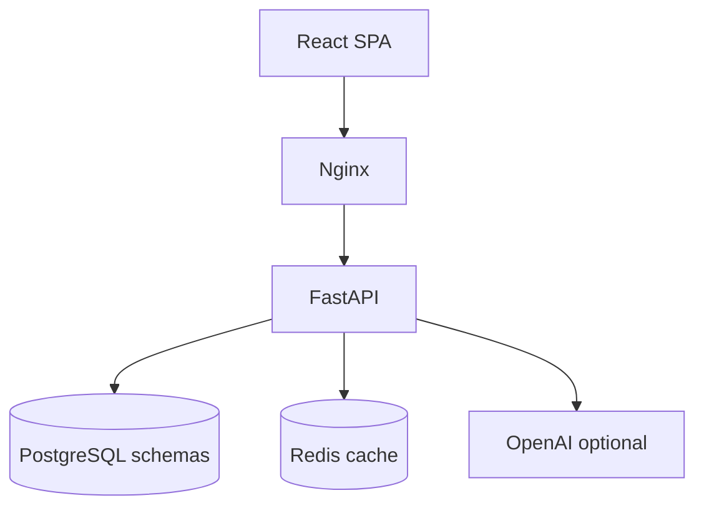

# Project 4 — Full-Stack React AI SaaS (Multi-Tenant Analytics + Text-to-SQL)

**Problem:** B2B teams need internal analytics where non-technical users ask questions in plain English instead of writing SQL.

**What it does:** User signs up → uploads CSV (or connects data in the tenant schema) → asks e.g. “What were the top 5 products last month?” → the LLM proposes SQL (with guardrails) → the API executes in an isolated workspace → the UI shows a **chart** (Recharts) plus an **AI-written summary**.

**Stack:** **React + TypeScript**, **FastAPI**, **PostgreSQL** with **pgvector** (image), **schema-per-tenant** isolation, **JWT** auth, **RBAC** (Admin / Analyst / Viewer), **OpenAI** text-to-SQL + insights (with **demo heuristics** when no key), **Redis** query cache, **Stripe** checkout + webhook stubs, **Google OAuth** routes, **Docker Compose**, **Playwright** smoke test, **GitHub Actions** CI.

**How it differs from a TypeScript CRUD “task” app:** This is a product-shaped SaaS slice—AI on the query path, payments hooks, multi-tenancy, and role gates—not a single-table CRUD demo.

**JD keywords:** React, TypeScript, Text-to-SQL, multi-tenancy, RBAC, Stripe, pgvector, FastAPI, PostgreSQL, Docker, CI/CD.

## Architecture



## Run (Docker)

```bash
cd project-4-fullstack-react-ai-saas
docker compose up --build
```

| Service | URL |
|--------|-----|
| UI (nginx) | http://localhost:5175 |
| API docs | http://localhost:28181/docs |
| Postgres | localhost:25434 (`saas` / `saas`) |
| Redis | localhost:26481 |

1. Open http://localhost:5175/register — create a workspace (new PostgreSQL schema).
2. Upload a CSV on the dashboard.
3. Ask e.g. “What was total revenue by region?” — **demo mode** uses rule-based SQL (no API key) that groups by sensible columns (region, category, etc.), not always the first CSV column.
4. For **LLM text-to-SQL + narrative summaries**, set `OPENAI_*` and `DEMO_MODE=false` in the **single** parent `3 project/.env` (the API loads only that file). Docker Compose injects `../.env` into the API. Restart the API container.

Compose uses fixed host ports (5175, 28181, 25434, 26481) so they are easy to remember and unlikely to collide with other common local stacks; change them in `docker-compose.yml` if something on your machine already binds those ports.

## Local dev (UI + API separately)

```bash
# Terminal A — Postgres/Redis from compose, or use local instances on 25434 / 26481
cd backend && pip install -r requirements.txt
uvicorn app.main:app --reload --port 28181

# Terminal B
cd frontend && npm install && npm run dev
```

Vite proxies API calls to `http://localhost:28181`.

## E2E

```bash
cd frontend && npm install && npx playwright install
BASE_URL=http://localhost:5175 npm run test:e2e
```

## Screenshots (UI UI images)

Add your UI screenshots in `frontend/public/screenshots` or any assets folder.

```markdown


```

You can include the exact images you shared in this path, then the README auto-loads them on GitHub.

## GCP / AWS

Build and push `backend` and `frontend` images; run API on Cloud Run / ECS; managed Postgres + Redis; set secrets for `JWT_SECRET`, `OPENAI_API_KEY`, Stripe keys.

## Keywords

React, TypeScript, FastAPI, PostgreSQL, pgvector, Redis, JWT, OAuth, multi-tenancy, RBAC, text-to-SQL, Stripe, Docker, GitHub Actions, Playwright.
